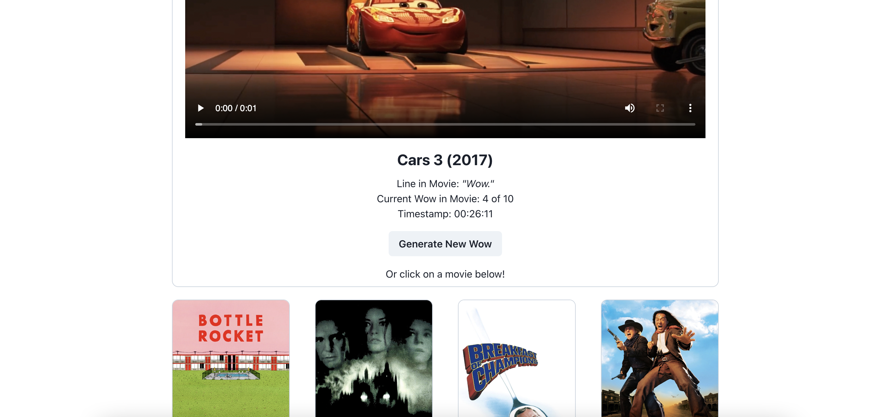
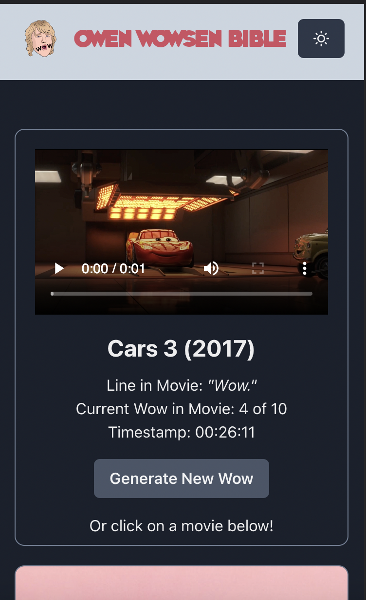

# SEI-Project-Two: Owen Wowsen


## Overview
This was the second project for the Software Engineering Immersive course with GA, which consisted of a hackathon over the course of a day and a half. I was paired with [klobbob](https://github.com/kobbob), and together we worked to plan, wireframe, and code the website.

You can find the deployed version of our project [here](https://the-great-greezybob-site.netlify.app/).

## The Brief

**Timeframe:**
* <36 hours

**General Project Brief:**
* Consume a public API – this could be anything but it must make sense for your project
* Have several components - At least one classical and one functional
* The app should include a router - with several “pages”
* Include wireframes - that you designed before building the app
* Be deployed online and accessible to the public

## Technologies 

* JavaScript (ES6+)
* React & React Router
* HTML5 & CSS3
* Sass
* Chakra UI
* Axios
* [The Owen Wilson WoW API](https://owen-wilson-wow-api.herokuapp.com/)
* VSCode
* Eslint
* Git & GitHub
* Insomnia

## Planning
We started this project out by first spending time picking a suitable API for this project. We were limited to free APIs and were also conscious of any APIs with strict rate limiting and tight limits.

## Overview
We chose to keep our site simple and clean given the time constraints. With this in mind we kept the site to one main page rather than having multiple different pages a user could click to. In order to make requests to the api we used axios and saved the resulting data to variables using the React useState and setState hooks.

For the design we opted for Chakra UI which allowed for a good amount of customisation whilst also having many prebuilt components that helped to speed up the design process. Chakra UI made it a lot easier to have a mobile first design. The site is fully compatible with mobile and has dark and light modes.

## Coding
To make requests to the public API we used axios and assigned the chosen data to variables using the React useState and setState hooks. The API used was fairly manageable to digest, with 0-29 objects within one array. There were twelve films within this array and each instance of ‘wow’ mentioned accounted for one object (and therefore certain films accounting for more than one ‘wow’).

We used the useEffect and useSate hooks to make a request to the api on page load and store the data in the variable wows.
```js
useEffect(() => {
    const getWows = async () => {
      try {
        const { data } = await axios.get('https://owen-wilson-wow-api.herokuapp.com/wows/ordered/0-29')
        setWows(data)

      } catch (error) {
        console.log(error)
      }
    }
    getWows()
  }, [])
```
We then needed to filter through the results to make sure we only displayed each movie once. The dependency in this instance is the wow state.
```js
useEffect(() => {
    let filteredArray = []
    wows.forEach(wow => wow.current_wow_in_movie === 1 ? filteredArray.push(wow) : '')
    setFilteredWows(filteredArray)
  }, [wows])
 ```
## Challenges/Wins
Working within a very short time frame meant really prioritising certain aspects over others, such as working to implement core features for the user over other aspects that aren't a top priority. Additionally using a new CSS framework to create a functional app in a short period of time. We were particularly happy with our light and dark mode compatibility and chosen colour scheme

## Key Learnings
This was our first instance of pair programming and building a React app. Some key takeaways were: 
Using React components and being able to organise and structure our code into different files that can be easily hooked up together. 
Gaining experience using a CSS framework for the first time and how this can aid your design process and efficiency. 
Understanding the potential of public APIs and how creative an end product can be. 


## Images
 

 


